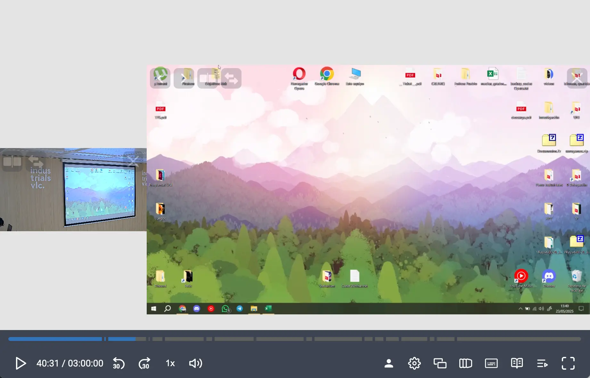

import { FileTree } from '@astrojs/starlight/components';
import Paella from '../../components/Paella.astro'

Paella Player For Opencast is a comprehensive video player integration for Opencast, built on top of [Paella Player 8](https://paellaplayer.webs.upv.es). This project provides packages and examples to integrate Paella Player with Opencast video management systems.



## 🚀 Features

- **Modern Web Components**: Built with web standards for easy integration
- **Opencast Integration**: Native support for Opencast APIs and workflows
- **Modular Architecture**: Pick and choose the components you need
- **TypeScript Support**: Full type safety and excellent developer experience
- **Responsive Design**: Optimized for desktop and mobile devices
- **Plugin System**: Extensible with custom plugins
- **Accessibility**: WCAG compliant video player

## 📦 Packages

This project contains the following packages:

### Core Packages

- **`@asicupv/paella-opencast-core`** - Core functionality and utilities for Opencast integration
- **`@asicupv/paella-opencast-component`** - Web component wrapper for easy integration
- **`@asicupv/paella-opencast-plugins`** - Collection of Opencast-specific plugins
- **`@asicupv/paella-opencast-skin`** - Default styling and themes

### Examples

- **`engage-paella-player`** - Complete Engage-style player implementation
- **`opencast-component-example`** - Simple web component usage examples

# Demo

This video demonstrates the integration of Paella Player with Opencast, showcasing its features and capabilities.
The video is hosted on [stable opencast demo](https://stable.opencast.org) server.

<Paella
    opencastPresentationUrl='https://stable.opencast.org'
    videoId='ID-dual-stream-demo'
/>

## 🛠️ Requirements

- **Node.js**: >= 22.0.0
- **npm**: >= 10.2.4

## 📖 Quick Start

### Installation

```bash
# Clone the repository
git clone https://github.com/polimediaupv/paella-opencast.git
cd paella-opencast

# Install dependencies
npm install

# Build all packages
npm run build
```


### Development

```bash
# Start development mode
npm run dev

# Start development for Engage player example
npm run dev:engage

```

## 🏗️ Project Structure

<FileTree>
- paella-opencast/
  - reference/                        *Core packages*
    - paella-opencast-core/           *Core functionality*
    - paella-opencast-component/      *Web component*
    - paella-opencast-plugins/        *Opencast plugins*
    - paella-opencast-skin/           *Styling and themes*
  - examples/                         *Usage examples*
    - engage-paella-player/           *Engage-style player*
    - opencast-component-example/     *Component examples*
  - doc/                              *Documentation*
</FileTree>


## 📚 Documentation

- **API Documentation**: Available in the `doc/` directory
- **Examples**: Check the `examples/` directory for working implementations
- **Paella Player 8 Docs**: [https://paellaplayer.webs.upv.es/](https://paellaplayer.webs.upv.es/)

## 🤝 Contributing

1. Fork the repository
2. Create a feature branch: `git checkout -b feature/my-feature`
3. Make your changes and add tests
4. Run the test suite: `npm test`
5. Commit your changes: `git commit -am 'Add new feature'`
6. Push to the branch: `git push origin feature/my-feature`
7. Submit a pull request

### Development Guidelines

- Follow TypeScript best practices
- Add tests for new functionality
- Update documentation as needed
- Ensure all components build successfully

## 🙏 Acknowledgments

- **Paella Player Team**: For the excellent video player foundation
- **Opencast Community**: For the robust video management platform
- **Universitat Politècnica de València**: For sponsoring the development

## 🐛 Issues & Support

- **Bug Reports**: [GitHub Issues](https://github.com/polimediaupv/paella-opencast/issues)
- **Documentation**: [Paella Player 8 Website](https://paellaplayer.webs.upv.es/)

---

**Developed with ❤️ by [ASIC - UPV](https://www.upv.es/entidades/asic/)**
