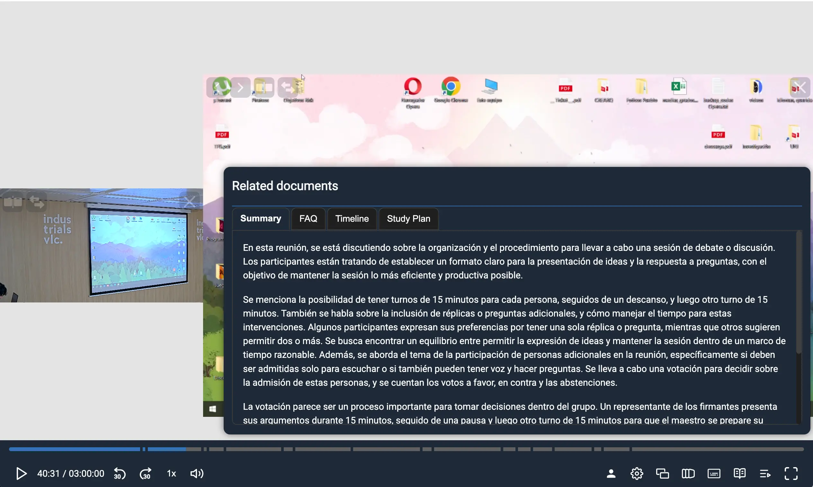

## org.opencast.paella.data.relatedDocumentsDataPlugin

This data plugin extracts and provides access to documents related to the current video event. It retrieves content from Opencast tracks and attachments based on configured flavors and makes them available to other plugins that need related document functionality.

This plugin requires the `@asicupv/paella-extra-plugins` package for related document types.

**Exported as** `OpencastRelatedDocumentsDataPlugin`.



## Configuration

You need to enable the `org.opencast.paella.data.relatedDocumentsDataPlugin` plugin and configure the document sources.

```json
{
    "org.opencast.paella.data.relatedDocumentsDataPlugin": {
        "enabled": true,
        "context": ["related.documents"],
        "docs": [
            {
                "title": "Summary",
                "content": { "flavor": "ai/summary", "mimeType": "text/markdown" }
            },
            {
                "title": "FAQ",
                "content": { "flavor": "ai/faq", "mimeType": "text/markdown" }
            },
            {
                "title": "Timeline",
                "content": { "flavor": "ai/timeline", "mimeType": "text/markdown" }
            },
            {
                "title": "Study plan",
                "content": { "flavor": "ai/study_plan", "mimeType": "text/markdown" }
            },
            {
                "title": "Podcast script",
                "content": { "flavor": "ai/podcast_script", "mimeType": "text/markdown" },
                "media": { "flavor": "ai/podcast_audio" }
            }
        ]
    }   
}
```

## Configuration parameters

- **`enabled`**: Enables or disables the plugin.
  - Valid values: `true` / `false`

- **`context`**: Array of context identifiers for data retrieval.
  - Default: `["file.content"]`
  - Example: `["file.content", "documents"]`

- **`docs`**: Array of document configurations defining what content to extract.

### Document configuration (`docs` array items)

Each document configuration object supports:

- **`title`**: Display name for the document.
  - Example: `"Presentation Slides"`

- **`content`**: Configuration for text/document content.
  - **`flavor`**: Opencast flavor to search for in attachments.
  - **`mimeType`** _(optional)_: Override the MIME type from the attachment.

- **`media`**: Configuration for associated media content.
  - **`flavor`**: Opencast flavor to search for in tracks.
  - **`mimeType`** _(optional)_: Override the MIME type from the track.

## Behavior

- **Content retrieval**: Fetches document content from URLs in the Opencast event
- **Filtering**: Only returns documents where content or media is successfully retrieved
- **Error handling**: Gracefully handles missing or inaccessible documents

## Functionality

The plugin:

1. **Searches attachments**: Looks for attachments matching configured content flavors
2. **Searches tracks**: Looks for tracks matching configured media flavors
3. **Fetches content**: Downloads text content from attachment URLs
4. **Provides media URLs**: Makes track URLs available for media content
5. **Returns structured data**: Provides documents in a format compatible with related document plugins

## Data format

The plugin returns an array of `RelatedDocument` objects with the structure:

```typescript
{
    title: string;
    content?: {
        data: string;
        mimeType: string;
    };
    media?: {
        url: string;
        mimeType: string;
    };
}
```

## Use cases

This plugin is typically used to provide:

- **Presentation slides** associated with lecture videos
- **Lecture notes** and supplementary materials
- **Transcripts** and closed captions
- **Supporting documents** like handouts or references

## Dependencies

- `@asicupv/paella-extra-plugins` package for `RelatedDocument` types
- Other plugins that consume related document data
