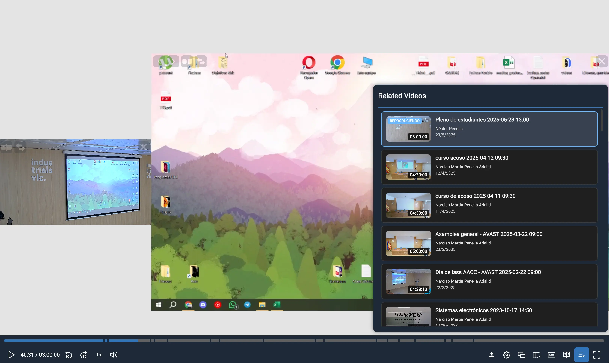

## org.opencast.paella.data.relatedVideosDataPlugin

This data plugin retrieves and provides access to videos related to the current video event. It searches for other videos in the same series using the Opencast Search API and makes them available to other plugins that need related video functionality.

**Exported as** `OpencastRelatedVideosDataPlugin`.



## Configuration

You need to enable the `org.opencast.paella.data.relatedVideosDataPlugin` plugin and configure the search parameters.

```json
{
    "org.opencast.paella.data.relatedVideosDataPlugin": {
        "enabled": true,        
        "maxCount": 5,
        "playerPreviewAttachmentsFlavours": ["presenter/search+preview", "presentation/search+preview"]
    }    
}
```

## Configuration parameters

- **`enabled`**: Enables or disables the plugin.
  - Valid values: `true` / `false`

- **`maxCount`**: Maximum number of related videos to retrieve.
  - Default: `5`
  - Example: `10`

- **`playerPreviewAttachmentsFlavours`**: Array of flavors to use for video preview images.
  - Example: `["presenter/search+preview", "presentation/search+preview"]`

## Behavior

- **Availability**: Only works with the Opencast Paella Player
- **Requirement**: Requires an Opencast presentation URL to be configured
- **Series dependency**: Only works for videos that belong to a series
- **Search scope**: Searches within the same series as the current video
- **Sorting**: Results are sorted by creation date (newest first)

## Data format

The plugin returns a `RelatedVideosDataResponse` object with:

```typescript
{
    total: number;      // Total number of related videos found
    skip: number;       // Number of items skipped (always 0)
    limit: number;      // Maximum number of items requested
    items: Array<{
        id: string;         // Video identifier
        title: string;      // Video title
        previewUrl?: string;// Preview image URL (if available)
        presenter?: string; // Comma-separated list of presenters
        startDate?: Date;   // Recording/publish date
        duration?: number;  // Duration in seconds
        url: string;        // Navigation URL to the video
    }>
}
```

## Use cases

This plugin is typically used to:

- **Show related lectures** in the same course series
- **Enable series navigation** between videos
- **Provide content recommendations** based on series membership
- **Create playlists** of related educational content

## Requirements

- Opencast presentation URL must be configured
- Videos must be organized in series
- Search API must be accessible
- Current video must have series metadata

## Error handling

The plugin gracefully handles:

- **Missing series**: Returns empty results if video has no series
- **API failures**: Returns empty results if search fails
- **Missing previews**: Continues without preview images
- **Network issues**: Fails silently and returns empty results

